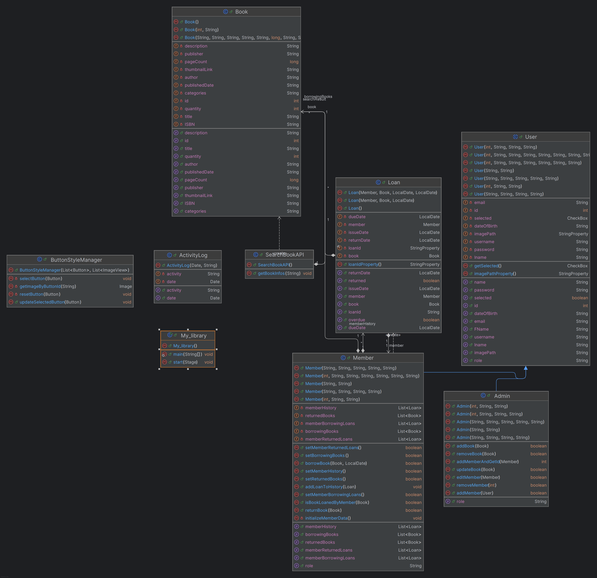

# 📚 Hệ thống Quản lý Thư viện
Link video: https://drive.google.com/file/d/1tAG36NUbQJU8DkdYxk3dtL2jlB75bTqf/view?usp=sharing

## 📝 Giới thiệu
Dự án này là một ứng dụng quản lý thư viện được xây dựng bằng **Java** với mô hình **MVC (Model - View - Controller)**.  
Ứng dụng hỗ trợ quản lý sách, người dùng, mượn – trả sách, thống kê và hiển thị giao diện trực quan cho cả **người quản trị (Admin)** và **thành viên (Member)**.  

---

## 🏛️ Class Inheritance Diagram


## ⚙️ Chức năng chính
### 👨‍💼 Dành cho Admin:
- Quản lý sách: thêm, xóa, sửa, tìm kiếm.
- Quản lý người dùng: thêm mới, chỉnh sửa, xóa, lọc, xuất dữ liệu.
- Xem nhật ký hoạt động của hệ thống.
- Thống kê: số lượng sách, người dùng, lượt mượn – trả.
- Bảng điều khiển (Dashboard) trực quan kèm biểu đồ.

### 👤 Dành cho Thành viên:
- Đăng ký, đăng nhập, chỉnh sửa hồ sơ cá nhân.
- Tìm kiếm và xem chi tiết sách trong thư viện.
- Mượn sách, trả sách, xem lịch sử mượn trả.
- Bảng điều khiển hiển thị sách mới, sách phổ biến, sách recommend.

---

## 📂 Cấu trúc dự án
### 1. **Controllers**
- `ActivityLogController`: Quản lý nhật ký hoạt động (log).
- `AddUserDialogController`: Thêm người dùng mới (có kiểm tra dữ liệu).
- `AdminPanelController`: Giao diện quản trị, điều hướng giữa các chức năng.
- `BigCardController`: Hiển thị thẻ sách lớn.
- `BookManagementController`: Quản lý sách (CRUD, tìm kiếm qua API).
- `BorrowBookController`: Quản lý mượn sách (chọn sách, hạn trả).
- `BorrowingCardController`: Hiển thị thông tin sách đang mượn.
- `DashboardController`: Trang quản trị, thống kê và biểu đồ.
- `DashboardMemberController`: Trang thành viên, hiển thị sách mới/phổ biến.
- `EditUserDialogController`: Chỉnh sửa thông tin người dùng.
- `LibraryController`: Hiển thị toàn bộ thư viện sách.
- `LoginController`: Đăng nhập (Admin/Member).
- `ProfileController`: Hồ sơ cá nhân (thông tin, avatar).
- `RentalController`: Quản lý mượn – trả cho thành viên.
- `ReturnedCardController`: Hiển thị thông tin sách đã trả.
- `SignUpController`: Đăng ký tài khoản (Admin/Member).
- `SmallCardController`: Hiển thị thẻ sách nhỏ.
- `UpdateBookController`: Cập nhật thông tin sách.
- `UserManagementController`: Quản lý người dùng (thêm, sửa, xóa, lọc, xuất).

### 2. **Exceptions**
- `ApplicationException`: Lỗi chung của ứng dụng.
- `AuthenticationException`: Lỗi xác thực.
- `BusinessLogicException`: Lỗi nghiệp vụ.
- `DatabaseException`: Lỗi cơ sở dữ liệu.
- `DuplicateDataException`: Dữ liệu trùng lặp.
- `InvalidDataException`: Dữ liệu không hợp lệ.

### 3. **Models**
- `ActivityLog`: Mô tả một bản ghi hoạt động.
- `Admin`: Mô tả tài khoản quản trị.
- `Book`: Mô tả sách (tên, tác giả, ISBN...).
- `ButtonStyleManager`: Quản lý giao diện nút bấm.
- `Loan`: Mô tả giao dịch mượn sách.
- `Member`: Mô tả tài khoản thành viên.
- `My_library`: Lớp chính khởi chạy ứng dụng.
- `SearchBookAPI`: Tìm kiếm sách qua API ngoài.
- `User`: Lớp trừu tượng cho các loại người dùng.

### 4. **Repositories**
- `BookRepository`: Tương tác CSDL cho sách.
- `DatabaseConnection`: Kết nối CSDL.
- `LoanRepository`: Tương tác CSDL cho giao dịch mượn.
- `UserRepository`: Tương tác CSDL cho người dùng.

### 5. **Services**
- `BookService`: Nghiệp vụ quản lý sách.
- `LoanService`: Nghiệp vụ quản lý mượn – trả.
- `UserService`: Nghiệp vụ quản lý người dùng, xác thực.

### 6. **UI Helpers**
- `AlertHelper`: Hiển thị cảnh báo, thông báo.
- `CardHelper`: Tạo và hiển thị thẻ sách.

---

## 🛠️ Công nghệ sử dụng
- **JavaFX**: Xây dựng giao diện.
- **JDBC**: Kết nối và thao tác cơ sở dữ liệu.
- **MySQL** : Lưu trữ dữ liệu.
- **Maven**: Quản lý dependencies.

---

## 🚀 Cách chạy dự án
1. Clone repository:
   ```bash
   git clone https://github.com/TrungHieu-alt/OOP
   ```
2. Cấu hình CSDL trong `DatabaseConnection.java`.
3. Khởi động ứng dụng bằng lệnh Maven:
   ```bash
   mvn clean javafx:run
   ```
---

👥 Vai trò người dùng
- Admin: Quản lý toàn bộ hệ thống.
- Member: Người dùng thông thường (mượn, trả sách).

---

📌 Hướng phát triển trong tương lai
- Tích hợp AI gợi ý sách theo sở thích.
- Hệ thống thông báo (email/app) khi gần đến hạn trả sách.
- Quản lý sách điện tử (E-book).
- Ứng dụng di động."

---

